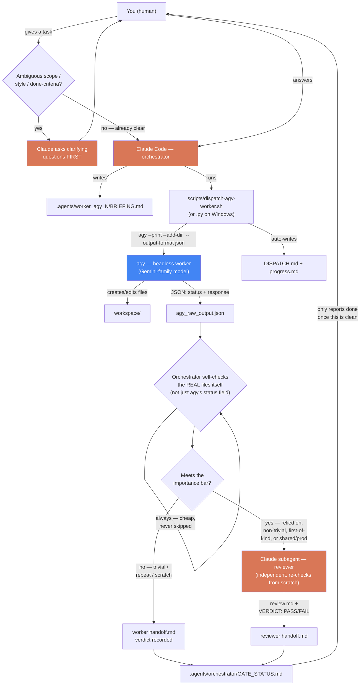

# agy-orchestrator

Claude Code as orchestrator, [agy](https://antigravity.google) (Antigravity
CLI) headless sessions as external workers — coordinated through a
file-based `.agents/` ledger. Claude clarifies scope with the human before
dispatching anything, always self-checks a worker's output directly, and
reserves a full independent Claude-subagent review for tasks that meet a
stated importance bar — not every trivial dispatch.

## How it works



**The two rules that matter most:**
1. `agy` reported `"status":"SUCCESS"` the first time we tested this — while
   it had actually written the file into its own scratch directory instead
   of the workspace we asked for. That's why the orchestrator's self-check
   loop is never skippable, even when the reviewer subagent is.
2. Asking "what do you mean by simple" costs one message. Discovering the
   worker built a full glassmorphism design system nobody asked for costs a
   whole dispatch cycle. Clarify first (top of the diagram) — see the
   Worked Examples below for exactly this happening.

## Install on any machine

Requirements: [Claude Code](https://claude.com/claude-code) and
[agy](https://antigravity.google/cli/install) both installed. On **Windows**,
that's it — the dispatch script has a pure-Python twin
(`dispatch-agy-worker.py`), so no WSL or Git Bash is required just for this
plugin (Claude Code itself may still need one of those for its own Bash
tool, independent of this plugin).

```
/plugin marketplace add https://github.com/anhnd3005-infinity/claude-agy-orchestrator.git
/plugin install agy-orchestrator@agy-orchestrator-marketplace
```

Repo is **public** — no SSH key, no GitHub login, no collaborator access
needed on any machine. (SSH also works if you prefer it and already have a
GitHub-linked key: `git@github.com:anhnd3005-infinity/claude-agy-orchestrator.git`.)

Check it landed: `/plugin` (or `claude plugin list` from a terminal) should
show `agy-orchestrator@agy-orchestrator-marketplace` as enabled. Works from
**any** project on the machine, not just this repo — see Worked Examples.

## How to use it

You don't need a slash command — this is a **skill**: Claude Code reads its
description and pulls it in automatically when relevant. Just ask normally,
in the same session where the plugin is installed, e.g.:

> "Dùng agy làm worker để tạo file X, chạy thử, rồi báo kết quả cho tôi."
> ("Use agy as a worker to create file X, test it, then report back.")

Expect Claude to **ask before it acts** if your request leaves scope, style,
or "done" ambiguous — that's step 0 of the skill, not a delay. Once scope is
clear, Claude will: write a `BRIEFING.md`, call
`scripts/dispatch-agy-worker.sh` (or `dispatch-agy-worker.py` on Windows)
with the right `--add-dir`, self-check the result itself, and only spin up
an independent reviewer subagent if the task meets the importance bar in
`SKILL.md`.

To force it explicitly (skip the auto-match), either say *"use the
dispatching-to-agy-workers skill for this"*, or use the bundled slash
command:

```
/agy-dispatch Tạo file X, chạy thử, báo kết quả cho tôi.
```

`/agy-dispatch` always routes through the skill — it never silently falls
back to doing the task natively in Claude. Add "quan trọng"/"important" in
the task text to force the independent reviewer subagent regardless of the
skill's normal importance-bar check.

You can also read the full pattern yourself first:
`skills/dispatching-to-agy-workers/SKILL.md` — it's one file, worth reading
end to end once.

## Worked examples

Two real dispatches, kept as evidence rather than a sales pitch:

**1. `hello.py` smoke test** (this repo — `.agents/`, `workspace/`,
`workspace2/`). First-ever dispatch of this skill. Attempt 1 silently wrote
to agy's scratch dir despite `status: SUCCESS`; attempt 2 (with `--add-dir`)
worked and was independently verified by a Claude reviewer subagent. This is
the run that produced the `--add-dir` gotcha and the whole ledger convention
in `SKILL.md`.

**2. `helloworld-tabs-demo`** (a *separate* project — proof the plugin works
from any project once installed, not just this repo). Asked for "1 website
đơn giản helloworld có vài tab và animation." What actually happened:
- Dispatched without clarifying "đơn giản" first (a mistake — this is what
  added step 0 to the process below).
- agy produced a fully-featured "Premium Dark & Glassmorphism" site: 3 tabs
  with a sliding indicator, 4 CSS keyframe animations, external CDN fonts/
  icons — accurate to the brief's letter, well beyond its intended spirit.
- Self-check via `grep -i "hello world"` came back empty — a **false
  negative**: the text was real, just split across an HTML `<span>` tag.
  Manual inspection found it. Naive substring checks are not enough; check
  rendered/semantic content.
- Asked the human afterward: keep the over-delivered design, or redo
  simpler? Keep. Independent reviewer needed, or self-check enough? Skip —
  human looked at it directly.
- Both the missed-clarification and the grep false-negative are now
  captured in `SKILL.md`'s "Lessons from real dispatches" log and its new
  step 0, so the next dispatch — on any machine that installs this plugin —
  starts from what this one learned.

## Known gotchas (see `SKILL.md` for the full, growing log)

- **`--add-dir` is mandatory.** Without it, `agy --print` may write into its
  own scratch directory instead of your workspace, while still reporting
  `SUCCESS`. Both `dispatch-agy-worker.sh` and `dispatch-agy-worker.py`
  always set it.
- **The dispatch script is bash — doesn't run natively on Windows** without
  WSL/Git Bash. `dispatch-agy-worker.py` is a behavior-identical port for
  Windows (or anywhere without a POSIX shell); same arguments, same output
  files.
- **Naive string checks during self-check can false-negative** on content
  split across HTML/markup tags. Verify meaning, not just raw substrings.
- **`SUCCESS` doesn't mean "matches intent.**" A worker can do exactly what
  it was told and still wildly overshoot unstated scope/style — this is a
  step-0 (clarify first) problem, not a step-4 (self-check) problem, though
  self-check should still flag it when it happens anyway.
- **Worker count is not fixed.** Nothing in the skill hardcodes how many
  `worker_agy_N` dispatches a task needs — the orchestrator decides per
  task, same judgment as `dispatching-parallel-agents`: one worker per
  independent unit of work, never two workers writing to the same
  `--add-dir` workspace concurrently.

## What's in here

- `skills/dispatching-to-agy-workers/` — the skill: `SKILL.md` (process,
  review policy, the gotcha log) + `scripts/dispatch-agy-worker.sh` and
  `scripts/dispatch-agy-worker.py` (behavior-identical dispatch wrappers,
  bash and pure-Python — both bake in `--add-dir` so it can't be forgotten).
- `commands/agy-dispatch.md` — `/agy-dispatch <task>`, forces the skill to
  handle a task instead of relying on auto-match.
- `.agents/` — the `hello.py` smoke test run, kept as a worked example.
- `workspace/`, `workspace2/` — that smoke test's actual output.

## Why this exists

`agy plugin install` lets *agy itself* run Superpowers-style skills natively
(agy as its own controller + worker via `invoke_subagent`). This plugin is
for the opposite shape: Claude Code stays the controller, and dispatches to
agy as an external, heterogeneous worker over the CLI — useful when you
specifically want agy's models/cost profile doing the execution while Claude
coordinates and reviews. It does **not** require Superpowers to be
installed — no dependency either way.

**Note on cost:** this pattern is not automatically cheaper than just asking
Claude Code directly — a trivial task dispatched through it can cost *more*
total tokens across both providers than doing it in one Claude turn (measured:
~150k tokens on the agy side alone for the "create hello.py" smoke test).
What it *does* do is shift execution-heavy work off Claude's metered usage
onto a separate provider's quota. If that quota is effectively free/abundant
to you, the savings on the Claude side scale with how heavy the offloaded
task is — a big code-generation task saves real Claude tokens; a trivial one
mostly just adds coordination overhead. It's a budget-allocation tool, not a
total-cost-reduction tool. See `skills/dispatching-to-agy-workers/SKILL.md`
for the full reasoning.

## Version history

- **0.3.0** — cross-platform dispatch: `dispatch-agy-worker.py`, a
  behavior-identical port of the dispatch script for Windows (or anywhere
  without bash) — no WSL/Git Bash required just for this plugin.
- **0.2.0** — step 0 (clarify with the human before dispatching), tiered
  review policy (independent reviewer only above an importance bar, cheap
  self-check always required), `/agy-dispatch` slash command, lessons log
  from the `helloworld-tabs-demo` dispatch.
- **0.1.0** — initial skill: `.agents/` ledger convention, `--add-dir`
  gotcha, mandatory reviewer, dispatch script, self-hosted marketplace.
