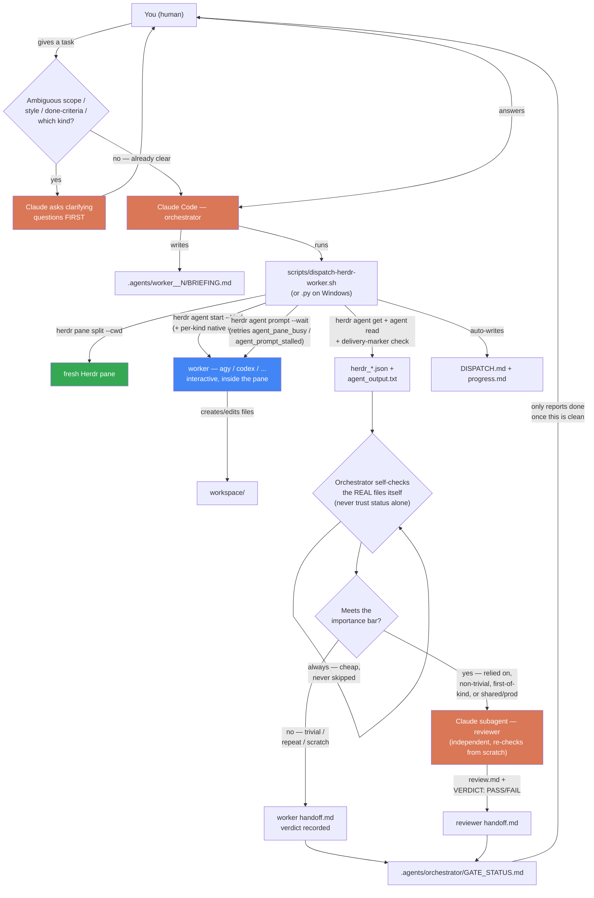

# agy-orchestrator

Claude Code as orchestrator, CLI agent workers of any
[Herdr](https://herdr.dev)-supported kind (`agy`, `codex`, and in principle
any other kind Herdr recognizes) running interactively inside
Herdr-managed panes — coordinated through a file-based `.agents/` ledger.
Claude clarifies scope with the human before dispatching anything, always
self-checks a worker's output directly, and reserves a full independent
Claude-subagent review for tasks that meet a stated importance bar — not
every trivial dispatch.

This started as an agy-only, headless (`agy --print`) plugin. It was
migrated to Herdr-managed panes and generalized to multiple agent kinds on
2026-08-13 — see Version history and `skills/dispatching-to-herdr-workers/
SKILL.md`'s Lessons log for the real, tested-not-assumed history of both
changes.

## How it works



**The rules that matter most:**
1. **Never trust a status code alone.** Across real dispatches: `agy`
   reported success while writing to its own scratch dir instead of the
   workspace; a fresh pane returned `agent_pane_busy` right after split;
   `agent_prompt_stalled` fired on every retry attempt even when the prompt
   had actually landed and the task completed correctly. Every one of these
   was only caught by checking the real artifact — the file, the pane
   transcript — not by reading a status field. That's why the
   orchestrator's self-check loop is never skippable, even when the
   reviewer subagent is.
2. Asking "what do you mean by simple" costs one message. Discovering the
   worker built a full glassmorphism design system nobody asked for costs a
   whole dispatch cycle. Clarify first (top of the diagram) — see Worked
   Examples below for exactly this happening.
3. **A worker kind is only as trusted as its track record.** `agy` has
   several real dispatches behind it (including the races above, now
   fixed); `codex` and any other kind are new integration surface the
   first time you use them here — treat their first dispatches like a new
   task type under the Review Policy, not a known quantity.

## Install on any machine

Requirements: [Claude Code](https://claude.com/claude-code), **Herdr**, and
whichever worker kind(s) you plan to dispatch to (`agy`, `codex`, ...).

### 1. Install Herdr

Herdr is the terminal/pane manager this plugin drives everything through —
it's a hard prerequisite, not optional. (`skills/dispatching-to-herdr-workers/
SKILL.md` checks `HERDR_ENV=1` before doing anything and refuses to run
without it.)

**macOS (Homebrew — official core formula):**
```bash
brew install herdr
```
Then either run it as a background service that also restarts at login:
```bash
brew services start herdr
```
or just run it directly without a background service:
```bash
/opt/homebrew/opt/herdr/bin/herdr server
```

**Other platforms:** check [herdr.dev](https://herdr.dev) for the current
Linux/Windows install method — not independently verified from this
machine, so no exact command is claimed here.

**Verify it's installed and you're inside a managed pane:**
```bash
herdr --version
echo "$HERDR_ENV"   # must print 1 — if empty, open a pane through Herdr's
                     # own UI/session first, this plugin cannot start Herdr
                     # for you
```

### 2. Install each worker kind you'll use

```bash
# agy (Antigravity CLI, Google)
curl -fsSL https://antigravity.google/cli/install.sh | bash        # macOS/Linux
irm https://antigravity.google/cli/install.ps1 | iex                # Windows PowerShell
curl -fsSL https://antigravity.google/cli/install.cmd -o install.cmd && install.cmd && del install.cmd  # Windows CMD
```
Verify: `agy --help`. For `codex` or any other kind, install it per its own
docs, then confirm Herdr recognizes it: `herdr agent` lists the full
supported-kind set.

On **Windows**, the dispatch script has a pure-Python twin
(`dispatch-herdr-worker.py`), so no WSL or Git Bash is required just for
this plugin (Claude Code itself may still need one of those for its own
Bash tool, independent of this plugin).

### 3. Install the plugin

```
/plugin marketplace add https://github.com/anhnd3005-infinity/claude-agy-orchestrator.git
/plugin install agy-orchestrator@agy-orchestrator-marketplace
```

Repo is **public** — no SSH key, no GitHub login, no collaborator access
needed on any machine. (SSH also works if you prefer it and already have a
GitHub-linked key: `git@github.com:anhnd3005-infinity/claude-agy-orchestrator.git`.)

Check it landed: `/plugin` (or `claude plugin list` from a terminal) should
show `agy-orchestrator@agy-orchestrator-marketplace` as enabled. Works from
**any** project on the machine, not just this repo — see Worked Examples.

## How to use it

You don't need a slash command — this is a **skill**: Claude Code reads its
description and pulls it in automatically when relevant. Just ask normally,
in the same session where the plugin is installed, e.g.:

> "Dùng agy làm worker để tạo file X, chạy thử, rồi báo kết quả cho tôi."
> ("Use agy as a worker to create file X, test it, then report back.")

or naming a different kind:

> "Dispatch this to a codex worker qua Herdr, rồi tự self-check kết quả."

Expect Claude to **ask before it acts** if your request leaves scope, style,
"done", or **which kind** ambiguous — that's step 0 of the skill, not a
delay. Once scope is clear, Claude will: write a `BRIEFING.md`, call
`scripts/dispatch-herdr-worker.sh` (or `.py` on Windows) with the right
kind and per-kind native args, self-check the result itself, and only spin
up an independent reviewer subagent if the task meets the importance bar in
`SKILL.md`.

To force it explicitly (skip the auto-match), either say *"use the
dispatching-to-herdr-workers skill for this"*, or use the bundled slash
command:

```
/herdr-dispatch Tạo file X bằng agy, chạy thử, báo kết quả cho tôi.
```

`/herdr-dispatch` always routes through the skill — it never silently falls
back to doing the task natively in Claude. Add "quan trọng"/"important" in
the task text to force the independent reviewer subagent regardless of the
skill's normal importance-bar check.

You can also read the full pattern yourself first:
`skills/dispatching-to-herdr-workers/SKILL.md` — it's one file, worth
reading end to end once.

## Worked examples

Real dispatches, kept as evidence rather than a sales pitch:

**1. `hello.py` smoke test** (this repo — `.agents/`, `workspace/`,
`workspace2/`). First-ever dispatch of this skill, back in its headless
`agy --print` era. Attempt 1 silently wrote to agy's scratch dir despite
`status: SUCCESS`; attempt 2 (with `--add-dir`) worked and was
independently verified by a Claude reviewer subagent. This is the run that
produced the `--add-dir` quirk-table entry and the whole ledger convention
in `SKILL.md`.

**2. `helloworld-tabs-demo`** (a *separate* project — proof the plugin works
from any project once installed, not just this repo). Also from the
headless era. Asked for "1 website đơn giản helloworld có vài tab và
animation." What actually happened:
- Dispatched without clarifying "đơn giản" first (a mistake — this is what
  added step 0 to the process below).
- agy produced a fully-featured "Premium Dark & Glassmorphism" site: 3 tabs
  with a sliding indicator, 4 CSS keyframe animations, external CDN fonts/
  icons — accurate to the brief's letter, well beyond its intended spirit.
- Self-check via `grep -i "hello world"` came back empty — a **false
  negative**: the text was real, just split across an HTML `<span>` tag.
  Manual inspection found it. Naive substring checks are not enough; check
  rendered/semantic content.
- Asked the human afterward: keep the over-delivered design, or redo
  simpler? Keep. Independent reviewer needed, or self-check enough? Skip —
  human looked at it directly.

**3. Herdr-pane migration smoke tests** (2026-08-13, `workspace4`–`workspace9`
in a throwaway demo dir, cleaned up after). Six live back-to-back
dispatches driving `agy` through fresh Herdr panes, specifically to
pressure-test the new mode before trusting it:
- Run 1 hit `agent_prompt_stalled` on the very first prompt — the script's
  first-pass logic read the still-`idle` status afterward and would have
  reported success on a task that never ran. Caught by checking the actual
  file: it didn't exist.
- Run 2 hit `agent_pane_busy` right after `pane split` — a pane isn't
  instantly "available" the moment split returns.
- Retry logic added for both, but still failed silently at first because
  herdr writes error JSON to **stderr**, and the retry checks were only
  looking at stdout.
- Even after fixing stdout/stderr, `agent_prompt_stalled` fired on **all 4**
  retries on one run — yet the file had actually been created correctly.
  Final fix: check the pane transcript itself for a fixed marker from the
  prompt template (normalized for word-wrap) before trusting any status at
  all.
- Run 6 (final): fully automatic, no manual intervention, correct file,
  correct exit code. All test panes closed and scratch dirs deleted
  afterward — nothing left behind but the lessons, now in `SKILL.md`.

All of the above — clarification misses, grep false-negatives, and every
Herdr-pane race — are captured in `SKILL.md`'s "Lessons from real
dispatches" log, so the next dispatch, on any machine that installs this
plugin, starts from what these already learned instead of re-discovering
them.

## Known gotchas (see `SKILL.md` for the full, growing log)

- **Herdr is a hard prerequisite, no fallback.** The skill checks
  `HERDR_ENV=1` and refuses to run without it — there is no headless mode
  to fall back to anymore.
- **`agy` needs `--add-dir`; other kinds might not.** Without it, `agy` may
  write into its own scratch directory instead of your workspace, while
  still reporting success. This lives in a small per-kind quirks table in
  the dispatch scripts (`KIND_NATIVE_ARGS` in Python, a `case` block in
  bash) — `codex` currently needs nothing extra, but that's only been
  reasoned about, not yet dispatch-tested.
- **Two Herdr-level races, not kind-specific:** a pane fresh out of `pane
  split` can briefly reject `agent start` with `agent_pane_busy`; the first
  `agent prompt` right after `agent start` can spuriously report
  `agent_prompt_stalled` even when it actually worked. Both scripts retry
  and, for the second one, cross-check the real pane transcript before
  trusting any status — don't hand-roll the `herdr` sequence without one of
  them.
- **herdr writes errors to stderr, not stdout.** Easy to miss when scripting
  your own `herdr` calls — a plain `$(cmd)` capture only sees stdout.
- **`--timeout` is capped at 300000 ms (5 min) per call, hard-rejected above
  that.** Both scripts validate this up front now. For a task expected to
  run longer, don't raise the number — loop `herdr agent wait <name>
  --timeout 300000` after dispatch instead. Exit code `3` means exactly
  this: still working past the given timeout, not a failure.
- **`done` is not safer to trust than `idle`.** Both are "settled" states
  per herdr's own docs, and both have independently produced the same
  false-positive (settled + zero error + completely empty pane). The
  delivery-marker check applies to both — an earlier revision that scoped
  it to `idle` only let the `done` case straight through in testing.
- **Don't drop `--wait` to dodge a flaky stall error.** Tested: without
  `--wait`, herdr reports success immediately with no way to tell whether
  the text actually landed. Verified live to be worse, not better — see
  `SKILL.md`'s Lessons log for the exact repro.
- **Naive string checks during self-check can false-negative** on content
  split across HTML/markup tags, or across wrapped terminal lines. Verify
  meaning, not just raw substrings — normalize whitespace first if checking
  pane transcripts.
- **`SUCCESS`-equivalent status doesn't mean "matches intent."** A worker
  can do exactly what it was told and still wildly overshoot unstated
  scope/style — this is a step-0 (clarify first) problem, not a step-4
  (self-check) problem, though self-check should still flag it when it
  happens anyway.
- **Worker count is not fixed.** Nothing in the skill hardcodes how many
  `worker_<kind>_N` dispatches a task needs — the orchestrator decides per
  task: one worker per independent unit of work, never two workers writing
  to the same workspace concurrently.

## What's in here

- `skills/dispatching-to-herdr-workers/` — the skill: `SKILL.md` (process,
  per-kind quirks table, review policy, the full lessons log) +
  `scripts/dispatch-herdr-worker.sh` and `scripts/dispatch-herdr-worker.py`
  (behavior-identical dispatch wrappers, bash and pure-Python — both bake
  in the per-kind quirks table and the race-condition retries so they can't
  be forgotten).
- `commands/herdr-dispatch.md` — `/herdr-dispatch <task>`, forces the skill
  to handle a task instead of relying on auto-match.
- `.agents/` — the `hello.py` smoke test run, kept as a worked example.
- `workspace/`, `workspace2/` — that smoke test's actual output.

## Why this exists

`agy plugin install` lets *agy itself* run Superpowers-style skills natively
(agy as its own controller + worker via `invoke_subagent`). This plugin is
for the opposite shape: Claude Code stays the controller, and dispatches to
an external, heterogeneous worker over Herdr — useful when you specifically
want a different CLI's models/cost profile doing the execution while Claude
coordinates and reviews. It does **not** require Superpowers to be
installed — no dependency either way.

**Note on cost:** this pattern is not automatically cheaper than just asking
Claude Code directly — a trivial task dispatched through it can cost *more*
total tokens across both providers than doing it in one Claude turn (measured:
~150k tokens on the agy side alone for the "create hello.py" smoke test).
What it *does* do is shift execution-heavy work off Claude's metered usage
onto a separate provider's quota. If that quota is effectively free/abundant
to you, the savings on the Claude side scale with how heavy the offloaded
task is — a big code-generation task saves real Claude tokens; a trivial one
mostly just adds coordination overhead. It's a budget-allocation tool, not a
total-cost-reduction tool. See `skills/dispatching-to-herdr-workers/SKILL.md`
for the full reasoning.

## Version history

- **0.4.1** — read https://herdr.dev/docs/agent-automation/ and tested every
  idea against real dispatches before adopting any of it: added hard
  `--timeout` bounds validation (3000, 300000] ms with a new `working`
  exit code (`3`) for legitimately-still-running tasks; tested and
  rejected dropping `--wait` (made delivery detection strictly worse, not
  better); documented a new `timeout`/queued-prompt error distinct from
  `agent_prompt_stalled`; found and fixed a regression where the
  delivery-marker check only covered `idle`, missing the identical
  false-positive under `done`.
- **0.4.0** — replaced headless `agy --print` with Herdr-managed
  interactive panes (lifecycle polling, follow-up prompts, live approval
  instead of `--dangerously-skip-permissions`); found and fixed 3 real
  races via live smoke testing (`agent_pane_busy`, stderr-vs-stdout error
  capture, unreliable `agent_prompt_stalled`); then generalized from
  agy-only to any Herdr-supported kind via a per-kind native-args table,
  renamed `dispatching-to-agy-workers` → `dispatching-to-herdr-workers`,
  `/agy-dispatch` → `/herdr-dispatch`.
- **0.3.0** — cross-platform dispatch: `dispatch-agy-worker.py`, a
  behavior-identical port of the dispatch script for Windows (or anywhere
  without bash) — no WSL/Git Bash required just for this plugin.
- **0.2.0** — step 0 (clarify with the human before dispatching), tiered
  review policy (independent reviewer only above an importance bar, cheap
  self-check always required), `/agy-dispatch` slash command, lessons log
  from the `helloworld-tabs-demo` dispatch.
- **0.1.0** — initial skill: `.agents/` ledger convention, `--add-dir`
  gotcha, mandatory reviewer, dispatch script, self-hosted marketplace.
