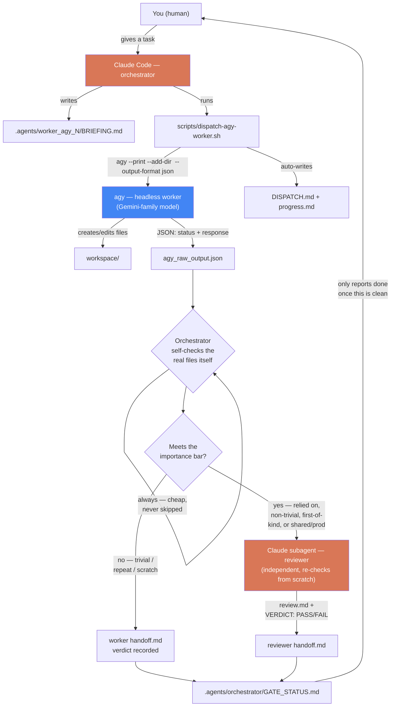

# agy-orchestrator

Claude Code as orchestrator, [agy](https://antigravity.google) (Antigravity
CLI) headless sessions as external workers — coordinated through a
file-based `.agents/` ledger. The orchestrator always self-checks a worker's
output directly; a full independent Claude-subagent review is reserved for
tasks that meet an importance bar, not spent on every trivial dispatch.

## How it works



**The one rule that matters most:** `agy` reported `"status":"SUCCESS"` the
first time we tested this — while it had actually written the file into its
own scratch directory instead of the workspace we asked for. That's why the
orchestrator's self-check (the loop in the middle) is never skippable, even
when the reviewer subagent on the right is.

## Install on any machine

Requirements: [Claude Code](https://claude.com/claude-code) and
[agy](https://antigravity.google/cli/install) both installed.

```
/plugin marketplace add git@github.com:anhnd3005-infinity/claude-agy-orchestrator.git
/plugin install agy-orchestrator@agy-orchestrator-marketplace
```

(HTTPS works too: `https://github.com/anhnd3005-infinity/claude-agy-orchestrator.git`)

Check it landed: `/plugin` (or `claude plugin list` from a terminal) should
show `agy-orchestrator@agy-orchestrator-marketplace` as enabled.

## How to use it

You don't run a slash command — this is a **skill**: Claude Code reads its
description and pulls it in automatically when relevant. Just ask normally,
in the same session where the plugin is installed, e.g.:

> "Dùng agy làm worker để tạo file X, chạy thử, rồi báo kết quả cho tôi."
> ("Use agy as a worker to create file X, test it, then report back.")

Claude will then, on its own: write a `BRIEFING.md`, call
`scripts/dispatch-agy-worker.sh` with the right `--add-dir`, self-check the
result, and only spin up an independent reviewer subagent if the task meets
the importance bar in `SKILL.md`.

To force it explicitly (skip the auto-match), either say *"use the
dispatching-to-agy-workers skill for this"*, or use the bundled slash
command:

```
/agy-dispatch Tạo file X, chạy thử, báo kết quả cho tôi.
```

`/agy-dispatch` always routes through the skill — it never silently falls
back to doing the task natively in Claude. Add "quan trọng"/"important" in
the task text to force the independent reviewer subagent regardless of the
skill's normal importance-bar check.

You can also read the full pattern yourself first:
`skills/dispatching-to-agy-workers/SKILL.md`.

## What's in here

- `skills/dispatching-to-agy-workers/` — the skill: `SKILL.md` (the pattern,
  the `--add-dir` gotcha, the review policy) + `scripts/dispatch-agy-worker.sh`
  (the actual dispatch wrapper — bakes in `--add-dir` so this can't be
  forgotten).
- `.agents/` — a real run of the pattern (smoke test: dispatched two agy
  workers, reviewed by a Claude subagent, gated PASS). Kept as a worked
  example.
- `workspace/`, `workspace2/` — the two workers' actual output, for
  reference.

## Why this exists

`agy plugin install` lets *agy itself* run Superpowers-style skills natively
(agy as its own controller + worker via `invoke_subagent`). This plugin is
for the opposite shape: Claude Code stays the controller, and dispatches to
agy as an external, heterogeneous worker over the CLI — useful when you
specifically want agy's models/cost profile doing the execution while Claude
coordinates and reviews. It does **not** require Superpowers to be
installed — no dependency either way.

**Note on cost:** this pattern is not automatically cheaper than just asking
Claude Code directly — a trivial task dispatched through it can cost *more*
total tokens across both providers than doing it in one Claude turn (measured:
~150k tokens on the agy side alone for a "create hello.py" smoke test). Its
value is in shifting execution load off Claude's metered usage onto a
separate provider's quota, running work in parallel across two rate limits,
or cross-model verification — not raw cost reduction. See
`skills/dispatching-to-agy-workers/SKILL.md` for when it's actually worth it.
